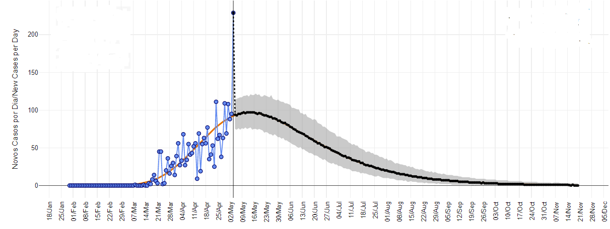

### Modelando a pandemia de Covid19
 
Dani Gamerman - Programa de PG em Estatística - UFMG

*1º semestre de 2020*

(motivado a partir de notas de José Marcos Andrade Figueiredo - UFMG)

#### Modelo de crescimento logı́stico básico

$$
Y(t) \sim N ( \mu (t) , \sigma^2 ), \qquad t = 1, 2, ...
$$

onde $Y(t)$ é o número de casos acumulados até o dia $t$ em uma dada região, com

$$
\mu ( t ) = \frac{ a \exp{ \{ c t \} } } {1 + b \exp { \{ c t \} }}.
$$
**Caso especial:** $b = 0$ (crescimento exponencial) $\rightarrow \mu(t) = a \exp \{ ct \}$.

- Adequado para os estágios iniciais da pandemia

##### Problemas do modelo básico:

a) os dados são contagens e a distribuição normal pressupõe dados contı́nuo;

b) a variância deveria aumentar com a magnitude dos dados.

##### Características de interesse:

As características mais importantes são:

**1) Taxa de infecção**

- $c$ mede a velocidade da aceleração e reflete a taxa de infecção da doença.

**2) Assíntota**
$$\lim_{t \to \infty}  \mu( t) = \lim_{t \to \infty} \frac{ a \exp{ \{ c t \} } } {1 + b \exp { \{ ct \} }} = \frac ab$$
- Reflete o total de casos acululados ao longo de toda a pandemia.

- Crescimento exponencial ($b=0$): assíntota $= \infty$ !

**3) Ponto de inflexão**

- É o tempo $t*$ onde o número de novos casos para de crescer e começa a diminuir.

- Crescimento exponencial ($b=0$): número de novos casos nunca para de crescer!

**4) Previsão:** 

- O que podemos dizer sobre $Y (t+k ), \forall k$, para $t$ fixo (hoje)? 
Depende da distribuição de $Y( t)$ mas será sempre dada pela distribuição preditiva de $Y(t+k)$ dado $Y(1:t) = \{ Y( 1) , ... , Y( t ) \}$, o que foi observado.

Funciona como se fosse a distribuição a posteriori de $Y(t + k )$.

**Resultado útil:** Se $Z$ e $W$ são 2 v. a.'s quaisquer então:

$E[Z] = E[ E(Z \mid W ) ]$

$Var[Z] = Var[ E(Z \mid W ) ] +  E[ Var( Z \mid W ) ]$

Em particular,
$E[Y ( t + k ) \mid Y( 1:t)] = E\{ E[ Y ( t + k ) \mid \mu( 1:t)] \mid Y( 1:t) \}$
$= E[ \mu( t+k )] \mid Y( 1:t) ]$, a média a posteriori de $\mu ( t + k )$.

A inferência para tudo que foi dito acima deve ser reportada através de estimadores pontuais (ex: médias a posteriori), junto com os respectivos intervalos de credibilidade.

**5) Número de reprodutibilidade $R_0$**

$R_0$ é o número esperado de casos secundários de uma doença produzidos por um indivíduo infectado.

No tempo $t$, ele é definido como 
$$R_0 = \frac {\mu ( t ) - \mu ( t-1)}{\mu ( t-1)}  = \frac {\mu ( t )}{\mu ( t-1)} - 1$$

**Início da epidemia:**
$1 \gg b \exp { \{ ct \} } \to \mu (t) \approx a \exp { \{ ct \} } \to R_0 \approx e^c - 1$

**Final da epidemia:**
$1 \ll b \exp { \{ ct \} } \to \mu (t) \approx a / b \to R_0 \approx 0$

**Meio da epidemia:** 
$R_0$ é função dos parâmetros $(a,b,c)$ e do tempo $t$, e é dado por
$$R_0 (t) = e^c \ \frac{1 + b e^c e^{ct} } {1 + b e^{ct} } \ - \ 1$$

Para cada $t$ fixado, podemos obter sua distribuição a posteriori (via amostra MCMC) e calcular média, quantis e intervalos de credibilidade.

**6) Número médio de novos casos (NMNC)**

NMNC no tempo $t+k$:
$n_t ( k ) = E [Y ( t + k ) - Y ( t + k -1 ) ] = \mu ( t + k ) - \mu ( t + k -1 )$

Logo, NMNC também é função dos parâmetros $(a,b,c)$ e pode ser facilmente calculado.

Para cada $t$ e $k$ fixados, podemos obter sua distribuição a posteriori (via amostra MCMC) e calcular média, quantis e intervalos de credibilidade.

#### Alternativas

1.1) $Y( t ) \sim Poisson ( \mu ( t ) )$ com $E[ Y(t)] = \mu (t )$ e $Var(Y(t)) = \mu ( t )$

1.2) $Y ( t ) \sim N ( \mu ( t ) , \sigma^2 \ \mu ( t ) )$ com $E[ Y(t)] = \mu (t )$ e $Var(Y(t)) = \sigma^2 \ \mu ( t )$

Obs:

- Modelo (1.2) admite sobredispersão se $\sigma^2 > 1$

- Alternativa (1.2) só cuida do comentário (b)

- Alternativa (1.1) cuida dos 2 comentários mas não permite sobredispersão

##### Poisson com sobredispersão

1.3) $Y( t ) \mid \epsilon ( t ) \sim Poisson ( \mu ( t ) + \epsilon ( t ) )$ com $E[  \epsilon (t)] = 0$ e $Var( \epsilon (t)) = \sigma^2$

1.4) $Y( t ) \mid \epsilon ( t ) \sim Poisson ( \mu ( t ) \times \epsilon ( t ) )$ com $E[  \epsilon (t)] = 1$ e $Var( \epsilon (t)) = \sigma^2$

Usando os resultados úteis anteriores:

**Mod(1.3):**
$E [ Y ( t ) ] = E[ E( Y(t) \mid \epsilon (t ) ) ] = E[  \mu ( t ) + \epsilon ( t ) ] = \mu ( t ) + E[ \epsilon ( t ) ] = \mu ( t )$

$Var[ Y ( t ) ] =  Var[ E( Y(t) \mid \epsilon (t) ) ]  + E[ Var ( Y(t) \mid \epsilon (t) ) ] = Var[ \mu ( t ) + \epsilon ( t )  ] + E [ \mu ( t ) + \epsilon ( t ) ] = \sigma^2 + \mu_t > \mu ( t )$

**Mod(1.4):**
$E [ Y ( t ) ] = E[ E( Y(t) \mid \epsilon (t)  ) ] = E[  \mu ( t ) \times \epsilon ( t ) ] = \mu ( t ) \times E[ \epsilon ( t ) ] = \mu ( t )$

$Var[ Y ( t ) ] =  Var[ E( Y(t) \mid \epsilon (t) ) ]  + E[ Var ( Y(t) \mid \epsilon (t) ) ] = Var[ \mu ( t ) \times \epsilon ( t )  ] + E [ \mu ( t ) \times \epsilon ( t ) ] =
\mu_t ^2 \sigma^2 + \mu_t > \mu ( t )$

Ambos preservam média da Poisson e aumentam dispersão da Poisson.

##### Extensões dinâmicas

Modelos anteriores assumem comportamento estático $\Rightarrow$ a forma
da doença não se modifica ao longo do tempo $\Rightarrow$ taxa de
infecção será sempre a mesma, assintota será sempre a mesma, \...

**Modelos dinâmicos** flexibilizam isso.

$$\mu ( t ) =  \frac{ a( {\color{red} t )} \ \exp{ \{ c( {\color{red}t) } \  t \} } } {1 + b( {\color{red}t) } \ \exp { \{ c({\color{red}t) } \ t \} }}$$

com:
$a ( t ) = a ( t-1) + w_a ( t )$, onde $w_a ( t ) \sim N ( 0 , W_a ), \forall t$.

$b ( t ) = b ( t-1) + w_b ( t )$, onde $w_b ( t ) \sim N ( 0 , W_b ), \forall t$.

$c ( t ) = c ( t-1) + w_c ( t )$, onde $w_c ( t ) \sim N ( 0 , W_c ), \forall t$.

**Vantagens:**

a) $E[ a(t) \mid a(t-1 )]= a (t-1)$, e o mesmo vale para $b(t)$ e $c(t) \Rightarrow$ constância local.

b) $Var[ a(t) \mid a(t-1 )]= W_a$, e o mesmo vale para $b(t)$ e $c(t) \Rightarrow$ aumento da incerteza.

**Problemas:**

a) variâncias $W_a, W_b, W_c$ conhecidas $\Rightarrow$ difíceis de especificar.

b) variâncias $W_a, W_b, W_c$ deconhecidas $\Rightarrow$ difíceis de estimar.

c) não dá para simplificar $W_a = W_b = W_c = W$ (magnitudes diferentes de $(a,b,c)$).

- Outra forma de introduzir dinamismo, agora multiplicativo:

$a ( t ) = a ( t-1) \times w_a ( t )$, onde $w_a ( t ) \sim Gamma ( d_a ,d_a ), \forall t$.

$b ( t ) = b ( t-1) \times w_b ( t )$, onde $w_b ( t ) \sim Gamma ( d_b ,d_b ), \forall t$.

$c ( t ) = c ( t-1) \times w_c ( t )$, onde $w_c ( t ) \sim Gamma ( d_c ,d_c ), \forall t$.

**Vantagens:**

a) $E[ a(t) \mid a(t-1 )]= a (t-1)$ e o mesmo vale para $b(t)$ e $c(t) \Rightarrow$ constância local.

b) $Var[ a(t) \mid a(t-1 )]= d_c^{-1}$ e o mesmo vale para $b(t)$ e $c(t) \Rightarrow$ aumento da incerteza.

c) Hiperparâmetros $d_a, d_b, d_c$ fáceis de especificar.

Exemplos:
$$d=1000 \ \to \ 0,90= P ( 0,95 < w(t) < 1,05 ) = P \left( 0,95 < \frac {a(t)}{a(t-1) } < 1,05 \right)$$
$$d=1500 \ \to \ 0,95= P ( 0,95 < w(t) < 1,05 ) = P \left( 0,95 < \frac {a(t)}{a(t-1) } < 1,05 \right)$$

**Problemas:**

a) As magnitures de $a, b, c$ ainda interferem no aumento da incerteza.

b) não sei se software lida bem com Gammas tendo parâmetros tão altos.

**Evolução multiplicativa com erros normais**

Considere a evolução multiplicativa abaixo para o parâmetro $a$:

$$a ( t ) = a ( t-1) \times \exp \{ w_a ( t ) \}, \mbox{ onde } w_a ( t ) \sim N( 0 , W_a )$$
Tomando o logartimo nos dois lados, obtem-se:
$$\log \ a ( t ) = \log \ a ( t-1) + w_a ( t ), \mbox{ onde } w_a ( t ) \sim N( 0 , W_a )$$
Passando $\log \ a ( t-1)$ para a esquerda, vem que:
$$\log \ a ( t ) - \log \ a ( t-1) =  \log \left[ \frac{ a ( t )}{ a ( t-1)} \right] = w_a ( t ), \mbox{ onde } w_a ( t ) \sim N( 0 , W_a )$$

Especificação de $W_a$: pode-se pensar em percentual de incremento, como antes.

$$0,95 = P \left( 0,95 < \frac {a(t)}{a(t-1) } < 1,05 \right) = P ( - 0,05 < w_a(t) < 0,05 )$$
Isso implica $2 \sqrt{W_a} = 0,05$, que implica $\sqrt{W_a} = 0,025 \ \Rightarrow W_a = (0,025)^2$.

Mesma especificação vale para $W_b$ e $W_c$, pois dimensões de $b$ e $c$ não importam.

**Caso particular**

Baseado em Gamerman, Santos e Franco (J. Time Series Analysis, 2013):

$$\mu ( t ) =  \frac{ a( {\color{red}t)} \ \exp{ \{ c \  t \} } } {1 + b \ \exp { \{ c \ t \} }}$$
$a ( t ) = a ( t-1) \times w_a ( t )$, onde $w_a ( t ) \sim Beta, \forall t$.

Pode ser usado também para crescimento exponencial ($b=0$).

**Vantagem:**

a) Permite contas exatas, dispensando aproximações MCMC.

**Desvantagem:**

a) Não permite $b$ e $c$ dinâmicos.

#### Generalizações da logística

Até agora, usamos a logística para especificar a média $\mu ( t )$ como
$$\mu ( t ) = \frac{ a \exp{ \{ c t \} } } {1 + b \exp { \{ ct \} }} = \frac{ a} { b + \exp { \{ - ct \} }}.$$
Essa expressão é a forma mais simples da logística.

Ela pode ser generalizada de várias formas. Uma possível forma da **logística generalizada** é
$$\mu ( t ) = d + \frac{ a - d} {(  b + \exp { \{ - ct \} } )^f}$$

A logística é obtida fazendo $d=0$ e $f=1$.

### Operacionalização dos modelos

Detalhes técnicos podem fazer diferença na aplicação prática.

- **Dados acumulados X dados diários**

  Pode ser vantajoso: modelar dados acumulados $\Rightarrow$ modelar dados diários

  média acumulada $\mu(t)$  $\Rightarrow$  média diária  $\mu(t) - \mu(t-1) \approx \mu'(t)$
  
  Independência condicional entre dias $\Rightarrow$ compatibilidade entre as duas modelagens
  
  $X(1) , ... , X(n) \stackrel{ind}{\sim} \ Poisson (\lambda(i)) , \ i=1, ... , n \quad \Rightarrow \quad \ \sum_i X(i) \sim \ Poisson \left( \sum_i \lambda(i) \right)$

- **Sazonalidade semanal**

  Algumas regiões apresentam padrão que se repete ao longo das semanas.
  
  Exemplo: fins de semana no Brasil apresentam decréscimos nas contagens
  
  Esse padrão pode ser tratado com deflatores associados a esses dias
  
- **Dados agregados X desagregados**

  Unidades com várias regiões modeladas pela soma das contagens nas regiões
  
  Exemplo: países modelados pela soma de seus estados
  
- **Várias ondas**

  Epidemias/pandemias podem se apresentar com várias ondas de casos
  
  Curva logística é usada para representar cada onda
  
  Várias ondas $\Rightarrow$ média dada pela soma das logísticas
  
  